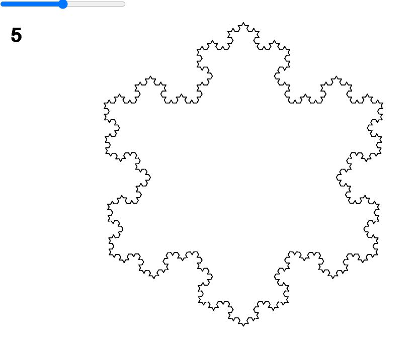

# Etude 3 Koch snowflake
### @Author Luka Didham

This program draws a fractal Koch Snowflake which dynamically scales with the window and
can be controlled with a slider paired with an iteration counter.
Sketch.js is the main P5 file which triggers the drawing and interactions
with the user. As P5 is a javaScript language the program can be launched form the
index.html file however unfortunatly needs to be launched on a live local server
and was unsure how to get it to run by simply starting an HTML file in a browser.
The snowflake program was tested on Google Chrome.

### How to run
As said above we cannot simply start the HTML file unfortunatly. P5 seems to require the HTML file to be booted on a lcoal server. I developed the program with the VS Code Live Server and tested the program with the Web Server for Chrome extension.

### Web Server for Chrome extension
https://github.com/processing/p5.js/wiki/Local-server
The simplest and fastest solution for anyone using a Chrome web browser is to install the Web Server for Chrome extension. Visit its chrome web store page and install it.

By default, the Web Server won't run in the background, so keep it open for it to work. To launch it on most devices, type chrome://apps in the Chrome address bar and press [Enter] to see all your Chrome apps, then click the Web Server icon. On a Chromebook, press the Search key (🔍) or click the Launcher icon (usually at the bottom left corner of the screen) to find and launch the Web Server.

After launching the Web Server a new window will open. There you can click [CHOOSE FOLDER] and select the folder with the HTML page for your sketch. Now you can just click on the Web Server URL (http://127.0.0.1:8887 by default) to see and open your sketch. If you name your sketch HTML page index.html and enable Automatically show index.html, your sketch will load as soon as you open the URL!

### VS Code Live Server
Using the Live Server extension for VS Code we can easily run a development web server for any local folder.

Instructions:
https://github.com/processing/p5.js/wiki/Local-server

Open the VS Code extension manager (CTRL-SHIFT-X / CMD-SHIFT-X)

Search for and install the Live Server extension.

Add a p5.js project folder to your VS Code Workspace.

With your project's index.html or sketch.js file open, start the Live Server using the "Go Live" button in the status bar, or by using ALT-L ALT-O.

Your sketch should now open in your default browser at location: 127.0.0.1:5500

### Improvements and Limitations
Due to limited time some parts of the program were not perfect. First scaling at above iteration 6 is quite laggy and annoying. This is becasue every time the screen size is changed the entire process is restarted making thousands of Line objects all over again. A better way of dealing with resizing the snowflake would have been to apply a uniform transform to all Line objects relative to the window size change instead of deletting and re-creating all from scratch.

Another option to speed up performance at high iteration counts would be not to store the objects above a certain point and simply recursivly draw the Line objects abnd then forget. I noticed from testing most of the lag seemed to come from the Array and Object creation as opposed to drawing the strokes of each line which seemed relativly fast.
